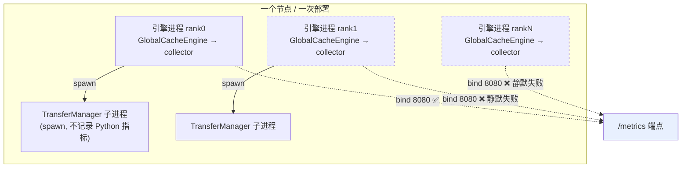

# Python 指标跨进程聚合 —— 设计文档

> 对应分支：`fix/metrics-multiprocess-aggregation`
> 配套文档：[修复文档](./multiprocess_metrics_fix_zh.md)（改了什么、怎么验、升级后影响）

## 0. 一句话结论

FlexKV 的 Python 指标之前**只暴露了随机一个进程的数据**，且失败时没有任何报错。
原因是多个引擎进程抢同一个指标端口，抢不到的静默放弃。本设计用 prometheus_client
的多进程模式把所有进程合并到同一个端点，并把"静默失败"改成"显式报错"。

---

## 1. 背景：指标在哪里产生

FlexKV 的 Python 指标全部由 `FlexKVMetricsCollector` 记录，而这个 collector 是在
`GlobalCacheEngine` 构造时初始化的：

```
flexkv/cache/cache_engine.py:811-813
    self._metrics_collector = get_global_collector()
    if self._metrics_collector is None:
        self._metrics_collector = init_global_collector()
```

`GlobalCacheEngine` 的持有者是 `KVTaskManager`（`flexkv/kvtask.py:137`），而
`KVTaskManager` 是**每个引擎进程各建一个**。所以进程拓扑是：



图里被虚线划掉的，就是修复前**完全不可见**的部分。TP=8 的部署意味着看到的数字
只覆盖 1/8，而且覆盖的是哪个 rank 每次重启都可能不同。

如何确认自己有几个进程在记录：

```bash
ls ${FLEXKV_PY_METRICS_MULTIPROC_DIR:-/tmp/flexkv-multiproc-8080}
# counter_1234.db  counter_1235.db  ...  → 每个 counter_<pid>.db 是一个记录进程
```

---

## 2. 问题：三个缺陷

| 编号 | 缺陷 | 位置（修复前 main） | 后果 |
|---|---|---|---|
| **D1** | 端点绑定进程内默认注册表 `REGISTRY`，只反映本进程 | `metrics/server.py:112` | N 个进程只有 1 个的数据可见 |
| **D2** | 抢不到端口时 `warning` + `return True`，调用方以为自己已经在暴露指标 | `metrics/server.py:121-129` + `metrics/collector.py:87-95` | 其余 N-1 个进程零感知地丢数据 |
| **D3** | 端口被**非 FlexKV** 服务占用时也走同一个"共享"分支 | `metrics/server.py:123-129` | 指标端点根本不是 FlexKV 的，仍报成功 |

D2 和 D3 叠加的杀伤力最大：日志里只有一行混在启动输出里的 warning，
`init_global_collector()` 照常返回 collector，从调用方看一切正常。

另外还有两个此前没被注意到、但同样属于"多进程正确性"的问题：

| 编号 | 缺陷 | 说明 |
|---|---|---|
| **D4** | `mempool_*` Gauge 的 `livesum` 只在环境变量已存在时才设置（`collector.py:194`），实际等价于从不生效 | 多进程下水位会翻倍或残留 |
| **D5** | prometheus_client 要求聚合目录在**启动时清空**，否则文件名按 pid 命名，重启一次就多一份，计数翻倍 | 不做处理的话每次重启所有 Counter 翻一倍 |

D5 是本设计里唯一一个"不实现就会引入新问题"的点：聚合本身会让目录里保留历史文件，
必须配套生命周期管理。

---

## 3. 目标与非目标

**目标**

1. 节点上所有 FlexKV 进程的 Python 指标都出现在同一个端点上，不丢进程。
2. 只有 1 个进程绑定端口，其余共享，端点是唯一的。
3. 任何"指标没被暴露"的情况都必须显式报错，不能静默。
4. 部署重启后计数从零开始，不叠加历史。
5. 进程退出后，水位类指标不再把它算进去；累计类指标不回退。

**非目标**

- 不改指标口径本身（不新增指标、不新增标签、不改埋点语义）。
- 不改 C++ 指标（端口 8081、编译期开关 `FLEXKV_ENABLE_MONITORING`）。
- 不做分层（L2/L3/L4）归属、不做健康探测、不做延迟分位数。这些是独立的后续项。

---

## 4. 方案

### 4.1 选 prometheus_client 多进程模式，而不是自己搭

| 方案 | 取舍 |
|---|---|
| **prometheus_client 多进程模式（mmap 目录）** ✅ | 官方支持、零新增依赖、Counter/Gauge/Histogram 语义已实现。代价：目录需要生命周期管理，且必须在 import 前设好环境变量 |
| Pushgateway | 指标要跨网络推，Pushgateway 是单点、无 TTL 语义，且把"拉取"改成"推送"与现有 Prometheus 抓取配置不兼容 |
| 每个进程一个端口 + Prometheus 多 target | 需要动态服务发现，部署方要改 scrape 配置；FlexKV 是引擎的旁路组件，不该要求宿主改 Prometheus 配置 |
| 自研 Unix socket / 共享内存聚合 | 等价于重写 prometheus_client 已有能力，还要自己处理 mmap 并发与文件格式 |

选它的硬约束是：**`PROMETHEUS_MULTIPROC_DIR` 必须在第一个 metric 对象构造之前进入环境变量**。
`prometheus_client` 在 import 时就绑定了值后端（`values.ValueClass = get_value_class()`），
之后再设环境变量无效。这决定了必须有一个"最先被 import"的模块，即新增的
`flexkv/metrics/registry.py`，并由 `flexkv/metrics/__init__.py` 首行导入。

### 4.2 目录的位置与生命周期

```
默认: <tmpdir>/flexkv-multiproc-<FLEXKV_PY_METRICS_PORT>
覆盖: FLEXKV_PY_METRICS_MULTIPROC_DIR
```

按端口推导的理由：同一次部署的所有进程配置同一个端口，因此天然共享同一目录；
不同端口的部署天然隔离。

生命周期用 owner 文件（`.flexkv-owner`）裁定：

```
进程启动 → makedirs
        → 尝试以 O_EXCL 创建 .flexkv-owner
            创建成功 → 我是本次部署的第一个进程 → 清空目录所有 .db
            已存在   → 读里面的 pid
                        活着且不是我 → 加入，只清理死进程文件
                        否则（陈旧）  → 接管，删除后重走创建流程
```

这一层是必需的，原因见 D5：文件名是 `counter_<pid>.db`，重启后 pid 变了就是新文件，
旧文件若不清，合并结果就是旧值 + 新值。

> 竞态窗口：两个进程同时冷启动时，先 claim 的那个在清空目录时可能抹掉另一个刚写的
> 值。窗口在微秒级，且此时值都接近 0，可接受。

### 4.3 两个注册表：metric 对象与合并器必须分开

这是本设计里唯一一个反直觉的点，有实测依据。

`prometheus_client` 的 metric 对象会报**本进程**的值，而 `MultiProcessCollector`
报目录下**所有进程合并**的值。两者注册进同一个 registry 时，`generate_latest()`
会把每条 series 输出两次：

```
fx_dup_total 3.0      ← metric 对象（本进程）
fx_dup_total 3.0      ← MultiProcessCollector（合并）
```

所以：

- `METRIC_REGISTRY`：metric 对象注册在这里，**永不对外服务**。
- `serve_registry()`：一个全新 registry，只挂 `FlexKVMultiProcessCollector`，
  这才是 `/metrics` 暴露的东西。

### 4.4 谁服务端点

只有 `multiprocessing.current_process().name == "MainProcess"` 的进程会调
`start_metrics_server()`。其余进程（spawn 出来的 TransferManager、被引擎拉起的
worker）只往共享目录写。

判据用进程名而不是"是否抢到端口"，是为了让行为可预测：一次部署确定只有一个端点，
不会某天因为调度抖动变成两个。

### 4.5 端口冲突：两种占用，两种处理

| 占用者 | 判定 | 行为 |
|---|---|---|
| 另一个 FlexKV 进程 | GET `/metrics` 返回内容含 `flexkv_` | 视为共享，返回 `True`，info 日志 |
| 其他服务 | 端口可连但内容不含 `flexkv_` | **抛 `RuntimeError`**，提示换 `FLEXKV_PY_METRICS_PORT` |
| 无法 bind 的其他 OSError | — | **抛 `RuntimeError`** |

`RuntimeError` 在 `_auto_start_metrics_server()` 里被捕获成 **error 级日志**，
不会打断引擎启动。这是刻意的：指标挂掉不该让服务起不来，但必须看得见。

为了让"端口上是 FlexKV"这个判定可靠，新增 `flexkv_py_metrics_server_info`
（恒为 1）。其他指标都只在被观测后才出现，刚启动的端点无法与任意 Prometheus
exporter 区分。

> 该 Gauge 没有 `pid` 标签：合并步骤会剥掉所有非 `all`/`liveall` 模式 gauge 的
> `pid` 标签（prometheus_client `multiprocess.py`），加了也只在非聚合场景出现，
> 同一个指标两种形状，不如不加。

### 4.6 Gauge 语义与死进程清理

prometheus_client 的可选模式里没有 `avg`，也不需要：

- **Counter**：只能累加。要看"单进程平均"应在 PromQL 做
  `sum(rate(...)) / count(rate(...))`，采集时平均会丢总量，进程数一变曲线就断。
- **`mempool_total/free_blocks`（Gauge）**：用 `livesum`。它们唯一用途是算水位，
  而比值必须先求和再相除。先算各进程水位再平均会让小池被等权放大——
  1000 块的池用了 10%、100 块的池用了 90%，真实水位 17.3%，平均得 50%。
- **`metrics_server_info`（Gauge）**：`max`。存在性标志，不是可累加量。

`livesum` 有个坑，必须配套清理才成立：

```
multiprocess.py 的 _accumulate_metrics 里，livesum 与 sum 走同一分支（都是 +=）。
live 前缀唯一的实际作用是决定 mark_process_dead(pid) 会不会删文件，
而 FlexKV 里没有任何地方调它。
```

所以 `FlexKVMultiProcessCollector` 在**每次 merge 前**清理死进程的 `gauge_live*`
文件，这才让 `livesum` 真的是"活着的进程之和"。只清 `gauge_live*`、不清 Counter：

- Counter 是累计量，进程死了它搬过的 blocks 也是事实，删掉会让曲线回退；
- live Gauge 是快照，进程没了就该没有这个数。

代价是每次采集多一次 `listdir` + 每文件一次 `kill(pid, 0)`，对十几个进程可忽略。

### 4.7 宿主引擎已在多进程模式时的兜底

如果 sglang/vLLM 在 import FlexKV 之前就 import 了 `prometheus_client`，
环境变量已经来不及生效。此时 `registry.py` 检查到值后端不是 `MmapedValue`，
会强制换成 `MultiProcessValue()` 并打 warning。

副作用：引擎之后新建的 metric 也会落进该目录（多写文件 + 需要清理）。这条路径
无法完全避免，只能保证**已知且可见**。`FLEXKV_ENABLE_METRICS=0` 时完全不动环境。

---

## 5. 风险与已知限制

| 项 | 说明 | 处置 |
|---|---|---|
| 计数变大 | 升级后 Counter 约变为进程数倍 | 这是修复生效。若没变，说明该部署本就只有 1 个进程在记录 |
| PID 复用 | 死进程判定用 `kill(pid, 0)`，pid 被复用会误判存活，残留旧值 | 低概率，只影响重启后的首个采集周期 |
| 目录共享 | 同机两套 FlexKV 用同一端口会串数据 | 用 `FLEXKV_PY_METRICS_MULTIPROC_DIR` 隔离 |
| 宿主引擎副作用 | 强制切换值后端会影响引擎之后建的 metric | 有 warning；`FLEXKV_ENABLE_METRICS=0` 时不触发 |
| 池是否独立 | `livesum` 正确的前提是各进程池互不相交 | 见修复文档的待确认项，给出了上机判据 |
| MLA broadcast | H2D 每 rank 各读全量，`transfer_bytes_total` 求和后是逻辑量的 N 倍 | 物理真值，但按"KV 吞吐"解读会虚高，已在 README 标注 |
| 目录残留 | 聚合目录不会自动删除，长期运行会残留 | 每次部署启动清空；`/tmp` 自身有清理策略 |

---

## 6. 未覆盖（后续独立项）

- 分层语义（L2 CPU / L3 SSD / L4 remote 的归属与层间 block 流）
- 健康层（in-flight / backlog gauge、IO 错误计数、is_healthy）
- 延迟分位数（传输耗时 Histogram，计时源在 `transfer/trace.py`）
- C++ 指标的 `FLEXKV_ENABLE_MONITORING` 编译期开关运行时化
